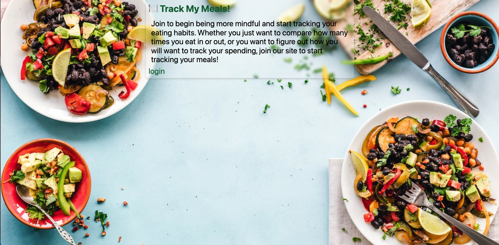

# TrackMyMeals

## License:

[](https://opensource.org/licenses/MIT)

## Description

- In todays world keeping track of your food consumption is a huge thing, but life is also hectic and full of so many things happening at once that it makes it hard to keep track of what you're eating. We wanted to create an app to help a user input and keep track of how many meals they eat in and out of home to help a user keep track of their eating habits.

## Table of Contents

- [Track My Meals](#track-my-meals)
- [License](#License)
- [Description](#description)
- [Technology Used](#technology-used)
- [Getting Started](#getting-started)
- [Installation](#installation)
- [Roadmap](#roadmap)
- [Contributing](#contributing)
- [Questions Contact](#questions-contact)
- [Github Project Link](#github-project-link)
- [Deployed Project Link](#deployed-project-link)
- [Acknowledgements](#acknowledgements)
- [Copyright](#copyright)

## Technology Used:

- (chart.js) - https://www.chartjs.org/
- (Mysql) - https://www.mysql.com/
- (Sequelize) - https://sequelize.org/
- (Handlebars) - https://handlebarsjs.com/
- (Heroku) - https://www.heroku.com/

## Getting Started:

- To get a local copy up and running follow the steps below.

## Installation:

1. Clone the Repository:

```sh
git clone https://github.com/timothymichaelcook/trackmymeals.git
```

## Screenshot:


- 


## Roadmap:

- Currently no known issues, but track [open issues] at (https://github.com/timothymichaelcook/trackmymeals.git/issues) for proposed features (and known issues) in the future.

## Contributing:

1. Fork the Project
2. Create your Feature Branch (`git checkout -b feature/AmazingFeature`)
3. Commit your Changes (`git commit -m 'Add some AmazingFeature'`)
4. Push to the Branch (`git push origin feature/AmazingFeature`)
5. Open a Pull Request

## Questions Contact:

If you have any questions, we can be reached by email:

- Elizabeth Lopez-Lopez - elizabethlopez0108@gmail.com
- Peggy Diosa - ruizpeggys@yahoo.com
- Timothy Cook - timothy.michael.cook@gmail.com

## Github Project Link:

- [https://github.com/timothymichaelcook/trackmymeals.git](https://github.com/timothymichaelcook/trackmymeals.git)

## Deployed Project Link:

- [https://sleepy-coast-17586.herokuapp.com/](https://sleepy-coast-17586.herokuapp.com/)


## Acknowledgements:

- University of Richmond Coding Bootcamp

## Copyright:

- Copyright (c) [2023] [Elizabeth Lopez-Lopez, Peggy Diosa, Timothy Cook]
